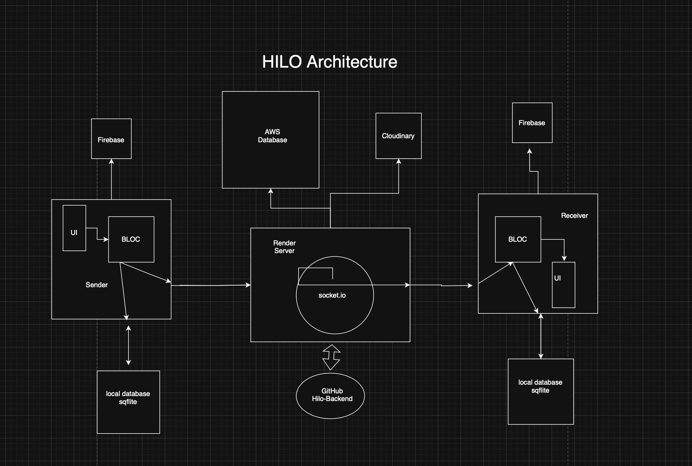

# HILO Chat App

A real-time chat application built with **Flutter** for the frontend and **Node.js + Socket.IO** with **PostgreSQL** for the backend, featuring local data persistence with **Sqflite** and rich chat functionalities including message send, receive, and "seen" status.

---

## Table of Contents

- [Features](#features)
- [Architecture](#architecture)
- [Local Database (Sqflite)](#local-database-sqflite)
- [Backend (Node.js + Socket.IO)](#backend-nodejs--socketio)
- [Frontend (Flutter)](#frontend-flutter)
- [How to Run](#how-to-run)
- [Contributing](#contributing)
- [License](#license)
- [Author](#author)
---

## Features

- User registration and profile management.
- Real-time messaging with Socket.IO.
- Persistent local storage via SQLite (Sqflite).
- Conversations listing with last message preview and timestamps.
- Profile pictures loaded from a URL or fallback to icons.
- Read receipts (message "seen" status) with real-time UI updates:
  - Single tick for sent messages.
  - Double blue ticks for seen messages.
- Message history loading from local DB and backend sync.
- Safe and robust handling through offline database.

---

## Architecture

### Frontend (Flutter)

- Uses **Flutter Bloc** for state management ([ChatBloc](./lib/features/chat/chat_bloc.dart), [InboxBloc](./lib/features/inbox/inbox_bloc.dart),[AuthBloc](./lib/features/auth/bloc/auth_bloc.dart)).
- Local persistence with **Sqflite** to store users, messages, and conversations.
- Real-time communication using a singleton **SocketService**, connecting via **Socket.IO client**.
- UI components for chat (`ChatView`), inbox (`InboxView`), and profile (`ProfileView`).
- Async fetching of user profile pictures with proper fallback icons.
- Handles message events such as send, receive, and message seen using socket event callbacks.
- Implements message "seen" logic by emitting `messageSeen` events to backend when messages are received or chat opened.
- Uses FirebaseAuth for authenticating/registering a user.

### Business Logic or State Management (BLOC)
- Different states of the application are managed by BLOC.
- Used to separate the UI from the business logic and smooth state management.

### Backend (Node.js + Socket.IO + Postgresql + Cloudinary)

- You can find the backend logic on the GitHub Repository Hilo-backend [Hilo-backend](https://github.com/pranjalsharmahp/hilo-backend.git)
- Express server with REST API endpoints managing users, conversations, and messages.
- PostgreSQL used for persistent storage.
- Socket.IO server handles real-time events:
  - `sendMessage` to broadcast new messages.
  - `messageSeen` to mark messages as seen in the database.
- Emits `markedAsSeen` events back to sender to notify message read status.
- Proper error handling and global error listeners.
- Cloudinary used for storing the users profiles pictures and then storing the url given by cloudinary into the profile_picture_url field of users table

---

## Local Database (Sqflite)

- **Tables:**
  - `users` — stores user info including email, name, profile picture URL, and bio.
  - `conversations` — maintains conversation metadata between two users.
  - `messages` — stores individual messages including `is_seen` flag.
- Uses integers (0/1) for `is_seen` due to SQLite limitations.
- Provides methods for inserting, querying, and updating data.
- Includes `markMessagesAsSeen(userEmail, otherUserEmail)` to batch update unseen messages.
- Syncs conversations and user data during initial startup.

---

## Backend (Node.js + Socket.IO)

- PostgreSQL schema includes `messages` table with `is_seen` column.
- Listens for:
  - `sendMessage` event where messages are stored and broadcast.
  - `messageSeen` event where messages from sender to receiver are updated as seen.
- Emits `markedAsSeen` events to notify the sender client of the message's seen status.
- Handles secure and conflict-safe upserts for conversations.

---

## How to Run

### Backend

1. Clone the backend repo.
2. Setup PostgreSQL and create databases/tables as per schema.
3. Configure `.env` variables for DB and server ports.
4. Run `npm install` to install dependencies.
5. Run `node server.js` to start the backend server or Host the GitHub repo on a cloud server as web service and access it through the given endpoint.

### Frontend

1. Clone the Flutter project repo.
2. Run `flutter pub get` to install dependencies.
3. Update backend URLs in `SocketService`.
4. Run on an emulator or real device: `flutter run`.

## Contributing

Contributions are welcome! You can help by:

- Reporting bugs and issues.
- Improving UI/UX.
- Adding new chat features or integrations.
- Optimizing local and realtime performance.

Please fork the repository and submit PRs for review.

---

## License

MIT License © 2025

---

---

> **Note:** This README is based on design and implementation details discussed including real-time Socket.IO integration, Sqflite local database schema, read-receipt logic, Flutter Bloc usage, and RESTful API backend calls.  
> Check the code files for updated and full function implementations.

---

If you have any questions or need more details about a specific part of the implementation, feel free to ask!

## Author
**Pranjal Sharma**.
**Email:** pranjalsharma.hp@gmail.com
